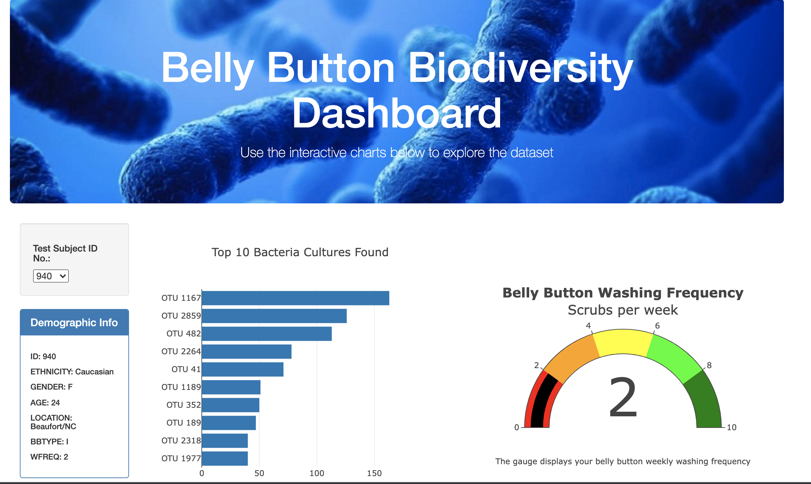
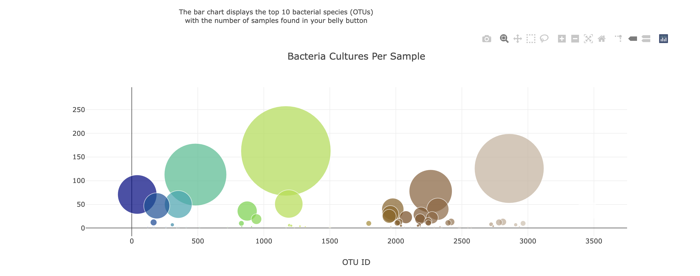

# Belly-Button Diversity 

## Project Overview
This project focuses on building an interactive dashboard to visualize the bacterial species living in the navel of candidates of a research about meat protein synthesis from human bacteria. 

## Resources
- Data Source: [Belly button samples data](https://github.com/zinashah8/belly_button/blob/main/samples.json)
- Tech used: HTML/CSS, JavaScript, VS Code, BootStrap, D3, Plotly

Link to Public Page:
[Greek Gods](https://zinashah8.github.io/plotly-deployment/)

Link to Public Page-2:
[Dashboard](https://zinashah8.github.io/belly-button/)

Dashboard Images:

